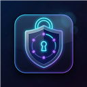

<div align="center">
  
  <h1>Local 2FA Authenticator</h1>
  <p><strong>A secure, offline, and beautifully designed 2FA/TOTP extension for your browser.</strong></p>
</div>

<hr/>

## 🛡️ Why Local 2FA Authenticator?
Many 2FA solutions store your sensitive secrets in the cloud or require you to pull out your phone every time you need to log in. **Local 2FA Authenticator** brings your OTP codes directly to your browser while prioritizing your privacy and security.

- **100% Offline & Local**: Your 2FA secrets never leave your device. There are no tracking scripts, no analytics, and absolutely no cloud syncing.
- **Client-Side Encryption**: Your vault is encrypted using the highly secure PBKDF2 (100,000 iterations) and AES-GCM encryption algorithms. Without your Master Password, your data is mathematically inaccessible.
- **Lightning Fast Workflow**: The extension intelligently reads the website you are on and automatically bubbles up the relevant 2FA codes to the top of your list.
- **Aesthetic UI/UX**: Built with a sleek, modern glassmorphism design that fully supports both Dark and Light modes out of the box.

## ✨ Features
- 🔒 **Zero-Knowledge Architecture:** Encrypted locally on your machine.
- 📸 **QR Code Import:** Easily import your accounts by scanning QR codes directly from your screen or uploading an image.
- 🔄 **Google Authenticator Migration:** Seamlessly import your existing accounts from Google Authenticator export files (`otpauth-migration://` URIs).
- 🧠 **Smart Sorting:** Automatically prioritizes and surfaces 2FA codes that match your current active tab's domain or subdomain.
- 🎨 **Modern Interface:** Eye-catching design, buttery smooth animations, and zero clutter.

## 🚀 Installation

**Quick Install (Recommended)**
1. Go to the [Releases page](https://github.com/emi-ran/local-2fa-extension/releases/latest).
2. Download the `local-2fa-extension-v1.0.0.zip` file.
3. Extract the ZIP file to a folder on your computer.
4. Open your browser and go to `chrome://extensions/` (or `edge://extensions/`).
5. Enable **Developer mode** in the top right corner.
6. Click **Load unpacked** and select the folder you just extracted.

**Developer Install (From Source)**
1. Clone the repository:
   ```bash
   git clone https://github.com/emi-ran/local-2fa-extension.git
   cd local-2fa-extension
   ```
2. Install the dependencies:
   ```bash
   npm install
   ```
3. Build the extension:
   ```bash
   npm run build
   ```
4. Load the `dist` folder via **Load unpacked** in your browser's extension settings.

## 🔐 Security & Privacy
This extension relies entirely on the browser's `chrome.storage.local` API. When you set a Master Password, the application derives a strong cryptographic key using PBKDF2 and encrypts your entire vault via AES-GCM. 
Even if someone gains physical access to your hard drive, your 2FA secrets remain completely safe without your Master Password.

*Note: There is no password recovery feature. If you forget your Master Password, you will lose access to your vault. Please remember it!*

## 🛠️ Built With
- [React](https://reactjs.org/) & [TypeScript](https://www.typescriptlang.org/)
- [Vite](https://vitejs.org/) for lightning-fast bundling.
- Native Web Crypto API for zero-dependency encryption.
- [jsQR](https://github.com/cozmo/jsQR) for QR Code parsing.

## 📄 License
This project is licensed under the MIT License - see the LICENSE file for details.
